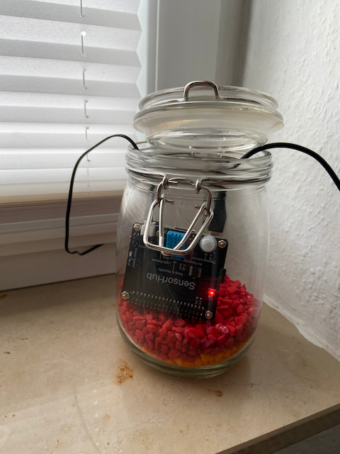

<p align="center">
    
</p>

<span align="center">

# Homebridge SensorHub
Homebridge Plugin for a SensorHub equipped Raspberry Pi.
<hr>
</span>

This is just a hobby project. My programming skills are a little bit rusty, so with this project I just want to learn a little bit about TypeScript and node.js and how to use git/github.

Having sad that, the code works and can be used and maybe will improve over time.

## Installation
To install Homebridge SensorHub:
- Follow the instructions on the [Homebridge Wiki](https://github.com/homebridge/homebridge/wiki) to install Node.js and Homebridge
- Install the Homebridge Sensorhub with [Homebridge Config UI X](https://www.npmjs.com/package/homebridge-config-ui-x) or install manually:
  ```
  $ sudo npm -g i homebridge-sensorhub
  ```

- Add `SensorHub` as platform to your `config.json` like this:

    ```
    {
        "bridge": {
            "name": "Homebridge",
            "username": "xx-xx-xx-xx-xx",
            "port": 1234
        },
        "platform": [
            {
                "platform": "SensorHub",
                "name": "SensorHub"
            }
        ]
    }
    ```
## Configuration
Here is the list of all configuration options with there default values:
```
    {
        "bridge": {
            "name": "Homebridge",
            "username": "xx-xx-xx-xx-xx",
            "port": 1234
        },
        "platform": [
            {
                "platform": "SensorHub",
                "name": "SensorHub",
                "interval": 10,
                "disableTemperatureService": false,
                "disableAirPressureService": false,
                "disableHumidityService": false,
                "disableLigthBrightnessService": false,
                "disableMotionDetectionService": false,
                "disableExternalTemperatureService": false,
                "temperatureCorrection": 0,
                "airPressureCorrection": 0,
                "humidityCorrection": 0,
                "brightnessCorrection": 0,
                "offBoardTemperatureCorrection": 0
            }
        ]
    }
```

## Known Issues
**AirPressure** - Seems like HomeKit does not support air pressure sensors. I found some solutions for Eve products with Custom-Characteristics, but I have to invest in this further.

**Incorrect sensor values** - My SensorHub sensor values are not correct. I added a simple correction value, but I'm quiete sure it's not just a simple linear correction what is needed. Any hint would be helpful. 
